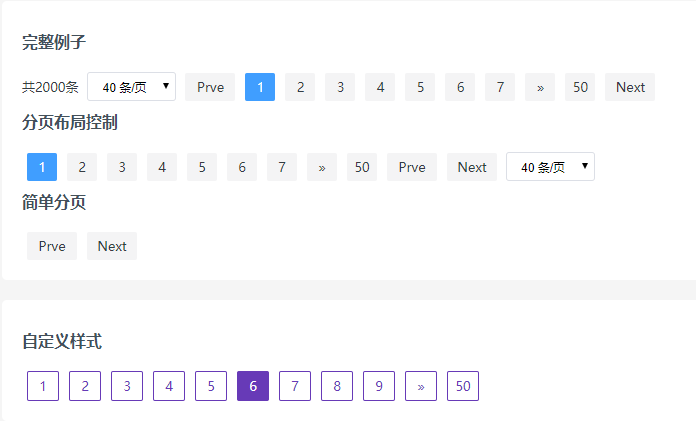

# Pagination

这是一个无任何依赖的PHP分页类。

```php
$pageSize = abs($_GET['pageSize']);
$pageSize = $pageSize ? $pageSize : 10;

$page = new Pagination(2000, $pageSize);

echo $page->links(); // output pagination html
```




## DEMO

```ls
php -S localhost:8082 -t .
```

```text
浏览器 打开 http://localhost:8082/examples/demo.php
```

## API

+ **new Pagination($total, $pageSize)** 创建分页对象

  - **$total** 数据总数。
  - **$pageSize** 分页大小，可选，默认 10。


**属性**

 + **Pagination::prevText** 上一页按钮文字，默认 'Prev'。
 + **Pagination::nextText** 下一页按钮文字，默认 'Next'。
 + **Pagination::hasPrevMore** 是否显示 prev more，默认 `false`。
 + **Pagination::hasNextMore** 是否显示 next more，默认 `false`。
 + **Pagination::containerClassName** 分页css类名。

**方法**

 + **Pagination::setQueryField($arr)** 设置分页查询字符串名称。
    - **$arr['page']** 当前页字段名，默认 'page'。
    - **$arr['size']** 分页大小字段名，默认 'pageSize'。

 + **Pagination::setQueryParams($arr)** 增加连接查询参数；`$arr` 为关联数组。
 + **Pagination::setPageSizes($arr)** 设置分页大小候选列表，默认：`[5, 10, 20, 30, 40]`。
 + **Pagination::links($layout)** 返回分页html，$layout 为布局数组。
    - **$layout** 可以定义为 `['total', 'sizes', 'prev', 'pager', 'next']`。
 + **Pagination::simpleLinks()** 返回简单分页html，只有上一页和下一页按钮。
 + **Pagination::getPageData()** 返回分页的一些数据。
