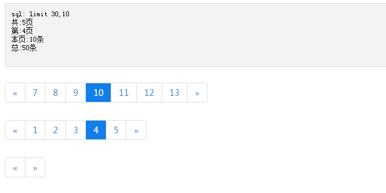

## Page

`Page` 是一个简单的PHP数据分页类。支持自定义参数，支持同页面多个分页。

分页结构是和boostrap中的分页结构是一样的，所以引用boostrap样式就会得到效果；当然如果页面不想引用boostrap样式可以使用本仓库里的page.css文件，这个样式与boostrap中的相差不大。

## 特点

+ 使用简单
+ 支持自定义参数
+ 支持同页面多个分页

## api

详细API可以看 [api.md](api.md)

## 例子

**用法：**

```php
$arr = [...];//数据数组
$rows = 10;//每页显示数据量
$page = new Page(count($arr), $rows);
//输出完整分页
$page->links();

//简单分页（只有‘上一页’，‘下一页’）
//$page->simpleLinks();
```

你要传入的参数是 `总的数据长度` 和 `每页显示数据长度`；这里并没有查询数据库的过程，是的这需你自己实现，因为此分页类编写的目只是处理分页，它不局限于数据库数据分页，你也可以对数组进行分页；对数组进行分页可以使用 `array_slice` 函数。

当然你可以使用分页对象构造的`limit` sql来拼接你的sql，具体的接口请看api文档。

## 截图




